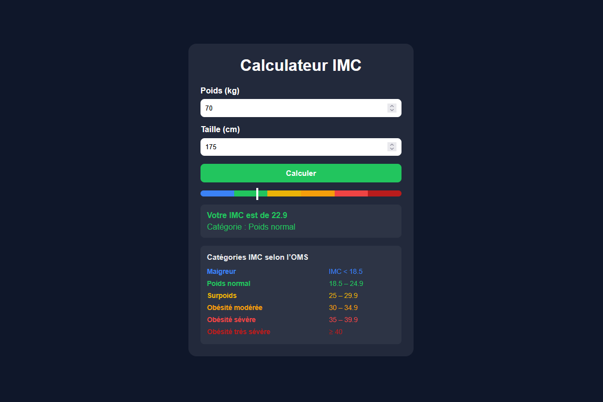

# 🧮 Calculateur d'IMC

Projet personnel réalisé en **HTML, CSS et Vanilla JavaScript**.

Cette application web permet de saisir un poids et une taille afin de calculer l'IMC et d'afficher la catégorie correspondante.

## 🖼️ Aperçu



## 🎯 Fonctionnalités

Le calculateur permet de :

- saisir un poids en kilogrammes
- saisir une taille en centimètres
- calculer l'IMC à partir des données saisies
- afficher le résultat avec une précision d'une décimale
- déterminer la catégorie d'IMC correspondante
- afficher la catégorie avec une couleur associée
- visualiser l'IMC sur une jauge colorée
- consulter les différentes catégories d'IMC dans un tableau
- gérer les données invalides

L'interface est responsive et s'adapte aux différentes tailles d'écran.

## 📊 Catégories d'IMC

Le calculateur utilise les catégories suivantes :

| Catégorie           | IMC         |
| ------------------- | ----------- |
| Maigreur            | < 18.5      |
| Poids normal        | 18.5 – 24.9 |
| Surpoids            | 25 – 29.9   |
| Obésité modérée     | 30 – 34.9   |
| Obésité sévère      | 35 – 39.9   |
| Obésité très sévère | ≥ 40        |

La jauge reprend ces six catégories afin de représenter visuellement la position de l'IMC calculé.

## ⚙️ Fonctionnement

L'IMC est calculé à partir du poids et de la taille :

```text
IMC = poids (kg) / [taille (m)]²
```

La taille saisie en centimètres est convertie en mètres avant le calcul.

Après validation des données saisies, le JavaScript :

1. calcule l'IMC
2. détermine la catégorie correspondante
3. affiche le résultat
4. applique la couleur associée à la catégorie
5. positionne l'indicateur sur la jauge

> L'IMC est un indicateur général et ne constitue pas un diagnostic médical.

## 🛠️ Technologies

- **HTML5**
- **CSS3**
- **Vanilla JavaScript**
- **Git**

## 🚀 Lancer le projet

Aucune installation ou dépendance n'est nécessaire.

1. Cloner ou télécharger le dépôt.
2. Ouvrir le fichier `index.html` dans un navigateur.
